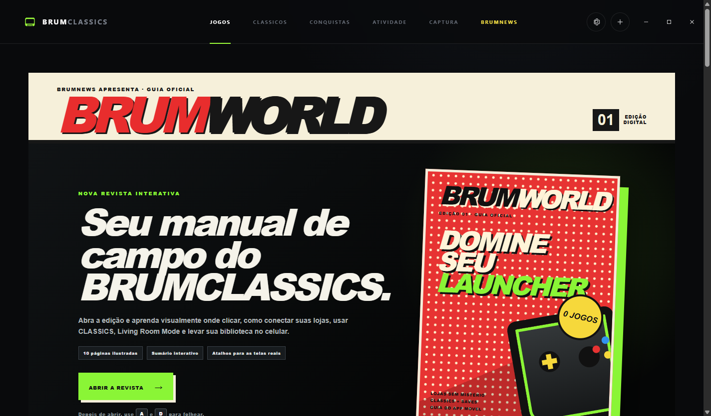
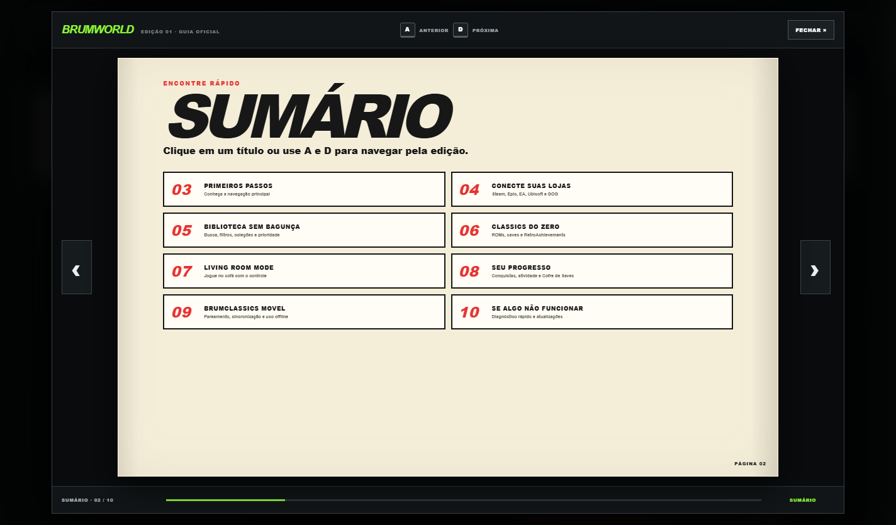
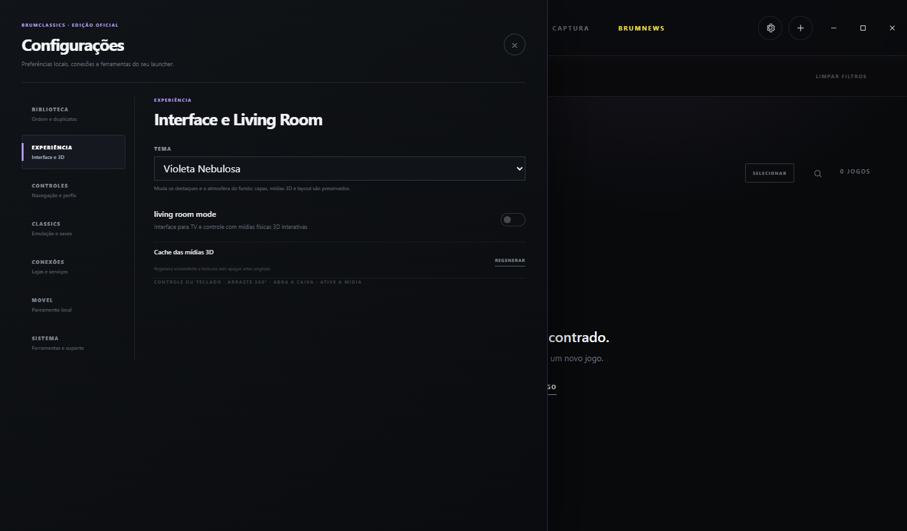

  

<h1 align="center">BRUMCLASSICS</h1>

  Biblioteca unificada para jogos modernos e clássicos no Windows, com aplicativos móveis complementares.

  <a href="https://github.com/GBrum0o0/BRUMCLASSICS/releases/latest"><strong>Baixar a versão mais recente</strong></a> ·
  <a href="SUPPORT.md">Ajuda</a> ·
  <a href="PRIVACY.md">Privacidade</a> ·
  <a href="SECURITY.md">Segurança</a>

## O que é

O BRUMCLASSICS reúne bibliotecas de jogos, CLASSICS, conquistas, sessões, coleções, saves, capturas e uma experiência para televisão chamada Living Room Mode. O BRUMCLASSICS MOVEL funciona como extensão do launcher e mantém uma cópia offline dos dados sincronizados pelo próprio usuário.

Esta página distribui o **BRUMCLASSICS OFICIAL**, preparado para uma instalação limpa em outros computadores. O pacote não contém contas, tokens, biblioteca, capas pessoais, favoritos, saves ou ROMs do computador usado no desenvolvimento.

## Principais recursos

- Biblioteca unificada de jogos modernos e clássicos.
- Integração com Steam, Epic Games, GOG, EA App e Ubisoft Connect, conforme a disponibilidade de cada serviço.
- Família Steam opcional: jogos compartilhados atualmente acessíveis entram identificados separadamente, sem serem tratados como compras da conta.
- Busca, filtros, coleções, favoritos e prioridade de loja.
- Jogos não oficiais podem ser cadastrados com executável local e SteamID opcional. **BUSCAR DADOS** usa o ID exato ou uma correspondência segura pelo nome para mostrar título oficial e recuperar capa e imagens, sem criar uma falsa licença de loja.
- Remover da biblioteca sem desinstalar o jogo; correção de seção pelo Perfil → Editar jogo.
- Conquistas modernas e RetroAchievements.
- Registro pessoal de **História completada** para jogos modernos e CLASSICS, separado do percentual de conquistas.
- CLASSICS com RetroArch, save states e Quick Resume.
- Living Room Mode com controle e mídia física 3D.
- BRUMWORLD: revista interativa com guias visuais do launcher e do aplicativo.
- Aplicativo Android com biblioteca offline, capas, estatísticas e BRUMCOMPANION.
- Aplicativo iOS pessoal em SwiftUI, com o mesmo cache offline, B-CARD e BRUMCOMPANION, preparado para sideload.
- B-CARD lista jogos instalados no celular e permite iniciar no computador com um gesto autenticado para cima.
- BRUMCOMPANION identifica o jogo ativo e permite consultar ou editar Onde parei, Objetivos, Dicas e Comandos no celular.
- O jogo ativo só aparece no BRUMCOMPANION quando possui alguma anotação; sessões sem conteúdo não criam cartões vazios.
- Durante a sessão, o BRUMCOMPANION acompanha CPU, GPU AMD/Intel/NVIDIA, RAM, VRAM, consumo do processo, duração, temperatura da CPU quando há sensor confiável e FPS real via PresentMon opcional. A coleta isolada pode ser desligada e não salva histórico por padrão.
- BRUMMOMENTS registra capturas do jogo ativo com localização, notas, categorias e favoritos em uma galeria privada disponível offline.
- Anotações e **Quero jogar** podem ser alterados fora da rede; a fila sincroniza ao reencontrar o launcher e conflitos exigem escolha explícita.
- Temas de destaque preservam o layout, incluindo o novo **Vermelho Arcade**.

## Download

Abra a página de [Releases](https://github.com/GBrum0o0/BRUMCLASSICS/releases/latest). Cada versão oferece:

1. **Launcher Windows** — executável portátil do BRUMCLASSICS OFICIAL.
2. **Pacote completo** — launcher, RetroArch limpo, pasta RETROGAMES vazia e APK.
3. **APK Android** — aplicativo móvel assinado para atualização preservando os dados offline.
4. **SHA256SUMS.txt** — hashes para verificar os arquivos baixados.

A versão pessoal para iPhone é compilada separadamente em **Actions → Build iOS pessoal**. O artefato contém um IPA sem assinatura para instalação com AltStore ou Sideloadly. No iOS 0.7.4, `CLASSICS Everywhere` importa cada ROM uma vez, abre formatos reconhecidos diretamente, registra o último jogo no próprio iPhone e conclui a sessão ao retornar do RetroArch. Consulte [as instruções do iOS](ios/README-IOS.md) e o [guia do RetroArch compatível](ios/RETROARCH-COMPATIVEL.md).

O GitHub hospeda os arquivos grandes na área de Releases; executáveis não são armazenados no histórico do repositório.

## Novidades da versão 1.54.0

A versão 1.54.0 adiciona a biblioteca da **Família Steam**. Depois de conectar a Steam normalmente, abra **Configurações → Conexões**, clique em **ATIVAR FAMÍLIA**, obtenha o token temporário na página oficial aberta pelo launcher e sincronize.

Confira as [notas e a validação](releases/v1.54.0/RELEASE-NOTES.md). O launcher identifica esses títulos como `family_shared`, mantém jogos próprios com prioridade por AppID e preserva o último catálogo familiar caso o token temporário expire.

Ela inclui o BRUMCLASSICS MOVEL 0.15.0. O APK preserva cache offline, capas, anotações, BRUMMOMENTS e pareamento ao ser instalado sobre a versão anterior.

## Instalação rápida

1. Baixe e extraia o pacote completo da Release mais recente.
2. Execute `BRUMCLASSICS OFICIAL.exe`.
3. Abra **Configurações → Conexões** e vincule somente suas próprias contas.
4. Para CLASSICS, coloque somente suas próprias ROMs na pasta `RETROGAMES`.
5. Para o celular, instale o APK e faça o pareamento em **Configurações → MOVEL** na mesma rede local.

## BRUMWORLD

Na aba BRUMNEWS, clique na capa da BRUMWORLD. Use `A` e `D` ou as setas laterais para folhear. O guia de biblioteca também ensina a cadastrar um jogo não oficial sem confundi-lo com uma licença Steam.

## Privacidade

- O pacote público é gerado com um perfil local limpo e isolado, sem dados do computador de desenvolvimento.
- Nenhuma credencial é incluída nos arquivos publicados.
- O pareamento móvel acontece na rede local e exige autorização do usuário.
- ROMs, BIOS e jogos comerciais não são fornecidos.

Leia a política completa em [PRIVACY.md](PRIVACY.md).

## Situação do projeto

O BRUMCLASSICS está em desenvolvimento ativo. Integrações de lojas dependem dos clientes e serviços oficiais e podem exigir ajustes quando os provedores alteram seus fluxos.

### Versão 1.44.3 — Um executável permanente

O launcher agora mantém o nome **`BRUMCLASSICS OFICIAL.exe`** em todas as versões. Depois da primeira abertura, use **Configurações → Sistema → Atualizações → ABRIR LOCAL** e fixe esse arquivo uma única vez na barra de tarefas. O launcher também consulta silenciosamente novas versões em toda abertura, sem baixar ou instalar nada sem sua confirmação.

Quem ainda está na 1.44.2 pode atualizar normalmente pelo launcher: a Release inclui um arquivo de transição reconhecido pelo mecanismo antigo. Contas, biblioteca, coleções, saves e configurações permanecem no perfil atual. [Veja todos os detalhes](releases/v1.44.3/RELEASE-NOTES.md).

Se o atualizador da 1.43.1/1.43.2 fechou sem voltar, consulte a [recuperação segura nas notas da 1.43.3](releases/v1.43.3/RELEASE-NOTES.md). O novo mecanismo só passa a ser utilizado após instalar a correção.

Também veja [Ciano Polar](docs/images/polar-theme-1.43.4.png) e [Rosa Synthwave](docs/images/synthwave-theme-1.43.4.png).

## Aviso

BRUMCLASSICS é um projeto independente e não é afiliado, endossado ou patrocinado por Valve, Epic Games, GOG, Electronic Arts, Ubisoft, Sony, Nintendo, Microsoft, Libretro ou RetroAchievements. Marcas pertencem aos seus respectivos proprietários.
