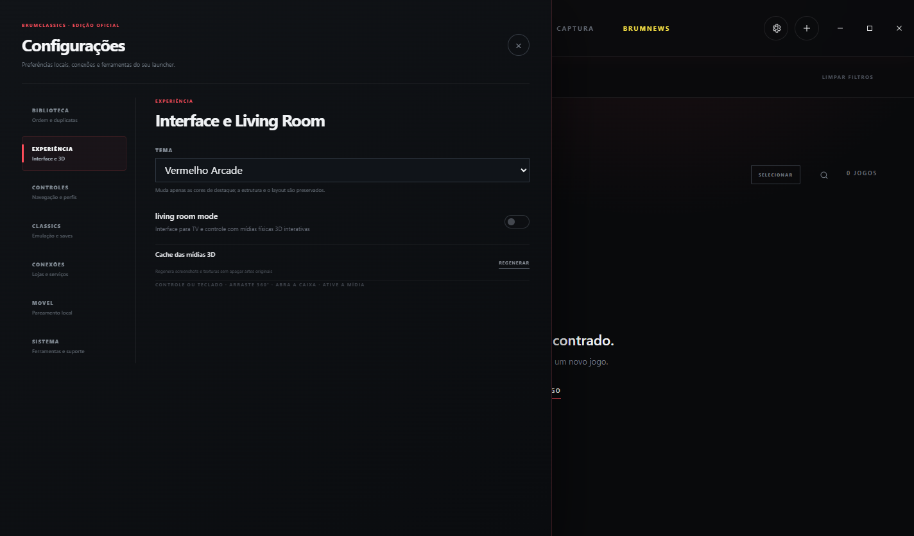

  

<h1 align="center">BRUMCLASSICS</h1>

  Biblioteca unificada para jogos modernos e clássicos no Windows, com aplicativo Android complementar.

  <a href="https://github.com/GBrum0o0/BRUMCLASSICS/releases/latest"><strong>Baixar a versão mais recente</strong></a> ·
  <a href="SUPPORT.md">Ajuda</a> ·
  <a href="PRIVACY.md">Privacidade</a> ·
  <a href="SECURITY.md">Segurança</a>

## O que é

O BRUMCLASSICS reúne bibliotecas de jogos, CLASSICS, conquistas, sessões, coleções, saves, capturas e uma experiência para televisão chamada Living Room Mode. O BRUMCLASSICS MOVEL funciona como extensão do launcher e mantém uma cópia offline dos dados sincronizados pelo próprio usuário.

Esta página distribui o **BRUMCLASSICS OFICIAL**, preparado para uma instalação limpa em outros computadores. O pacote não contém contas, tokens, biblioteca, capas pessoais, favoritos, saves ou ROMs do computador usado no desenvolvimento.

## Principais recursos

- Biblioteca unificada de jogos modernos e clássicos.
- Integração com Steam, Epic Games, GOG, EA App e Ubisoft Connect, conforme a disponibilidade de cada serviço.
- Busca, filtros, coleções, favoritos e prioridade de loja.
- Conquistas modernas e RetroAchievements.
- CLASSICS com RetroArch, save states e Quick Resume.
- Living Room Mode com controle e mídia física 3D.
- BRUMWORLD: revista interativa com guias visuais do launcher e do aplicativo.
- Aplicativo Android com biblioteca offline, capas, estatísticas e BRUMCOMPANION.
- BRUMCOMPANION identifica o jogo ativo e permite consultar ou editar Onde parei, Objetivos, Dicas e Comandos no celular.
- Temas de destaque preservam o layout, incluindo o novo **Vermelho Arcade**.

## Download

Abra a página de [Releases](https://github.com/GBrum0o0/BRUMCLASSICS/releases/latest). Cada versão oferece:

1. **Launcher Windows** — executável portátil do BRUMCLASSICS OFICIAL.
2. **Pacote completo** — launcher, RetroArch limpo, pasta RETROGAMES vazia e APK.
3. **APK Android** — versão móvel de teste.
4. **SHA256SUMS.txt** — hashes para verificar os arquivos baixados.

O GitHub hospeda os arquivos grandes na área de Releases; executáveis não são armazenados no histórico do repositório.

## Instalação rápida

1. Baixe e extraia o pacote completo da Release mais recente.
2. Execute `BRUMCLASSICS-OFICIAL-<versão>-portable.exe`.
3. Abra **Configurações → Conexões** e vincule somente suas próprias contas.
4. Para CLASSICS, coloque somente suas próprias ROMs na pasta `RETROGAMES`.
5. Para o celular, instale o APK e faça o pareamento em **Configurações → MOVEL** na mesma rede local.

## BRUMWORLD

Na aba BRUMNEWS, clique na capa da BRUMWORLD. Use `A` e `D` ou as setas laterais para folhear. O sumário abre diretamente os guias de lojas, biblioteca, CLASSICS, Living Room, conquistas, saves, diagnóstico e aplicativo móvel.

## Privacidade

- O pacote público é gerado com um perfil local limpo e isolado, sem dados do computador de desenvolvimento.
- Nenhuma credencial é incluída nos arquivos publicados.
- O pareamento móvel acontece na rede local e exige autorização do usuário.
- ROMs, BIOS e jogos comerciais não são fornecidos.

Leia a política completa em [PRIVACY.md](PRIVACY.md).

## Situação do projeto

O BRUMCLASSICS está em desenvolvimento ativo. Integrações de lojas dependem dos clientes e serviços oficiais e podem exigir ajustes quando os provedores alteram seus fluxos.

### Versão 1.43.2 — Vermelho Arcade e atualização de perfil segura

O novo tema **Vermelho Arcade** pode ser escolhido em **Configurações → Visual → Tema**. Destaques, brilhos, foco, progresso e superfícies reativas acompanham a cor selecionada sem alterar capas, organização ou mídias físicas 3D.

A versão também incorpora a preservação de perfil da 1.43.1: uma atualização pelo launcher mantém contas, biblioteca, coleções, anotações, configurações e saves no diretório original, mesmo quando o executável publicado usa o perfil limpo por padrão. Instalações novas continuam isoladas. O APK permanece na versão 0.8.0.

## Aviso

BRUMCLASSICS é um projeto independente e não é afiliado, endossado ou patrocinado por Valve, Epic Games, GOG, Electronic Arts, Ubisoft, Sony, Nintendo, Microsoft, Libretro ou RetroAchievements. Marcas pertencem aos seus respectivos proprietários.
