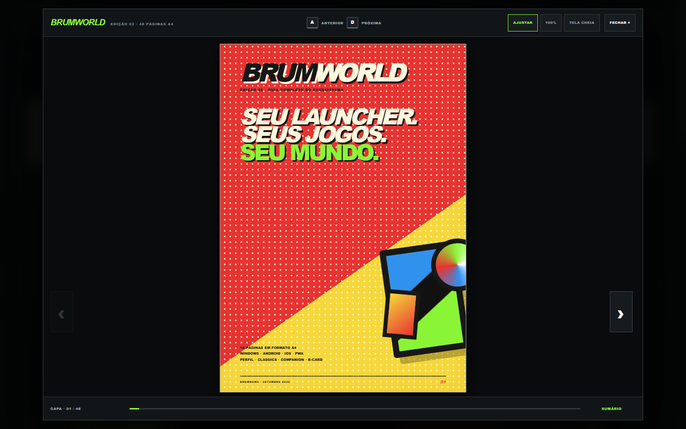
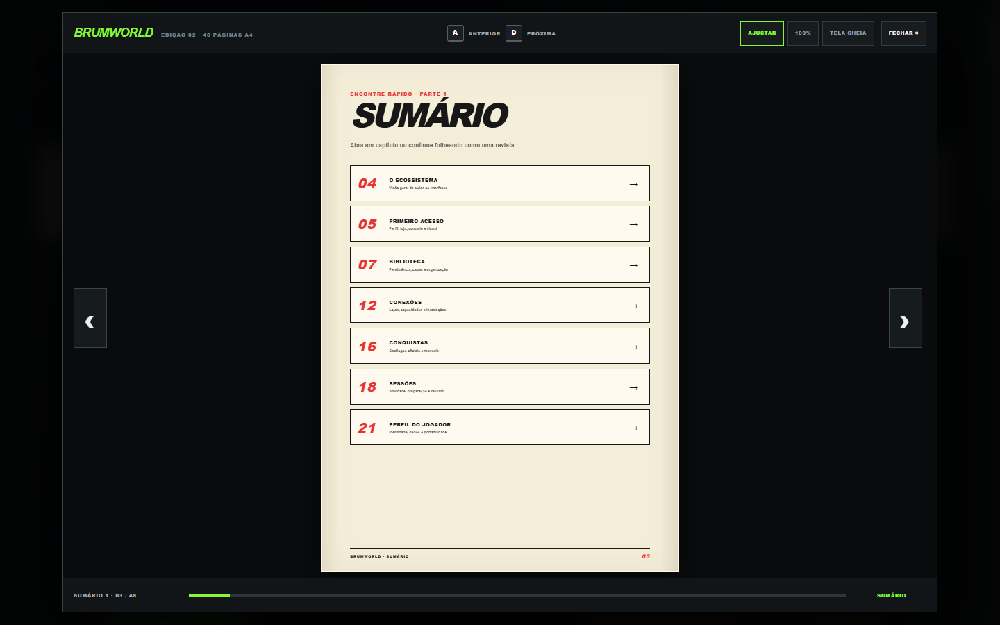
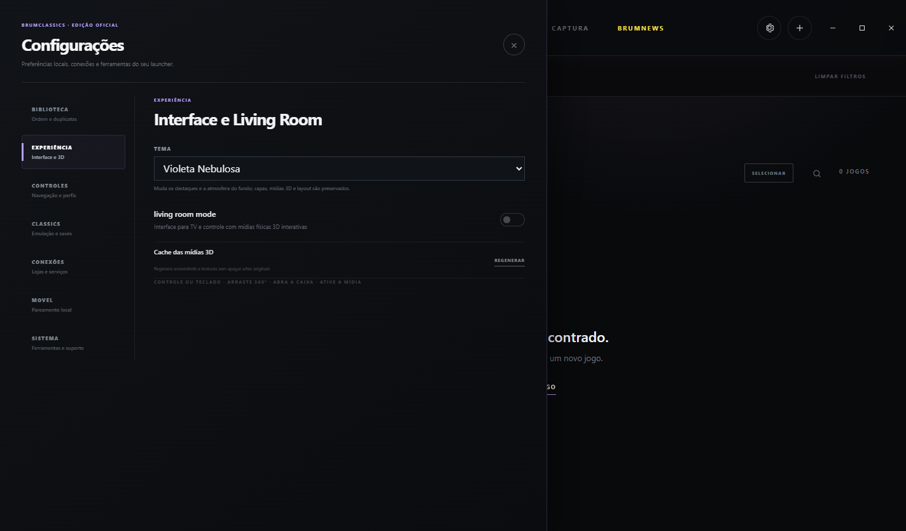

  

<h1 align="center">BRUMCLASSICS</h1>

  Biblioteca unificada para jogos modernos e clássicos no Windows, com aplicativos móveis complementares.

  <a href="https://github.com/GBrum0o0/BRUMCLASSICS/releases/tag/v1.75.1"><strong>Windows 1.75.1</strong></a> ·
  <a href="https://github.com/GBrum0o0/BRUMCLASSICS/releases/tag/android-v0.21.0"><strong>Android 0.21.0</strong></a> ·
  <a href="https://github.com/GBrum0o0/BRUMCLASSICS/releases/tag/ios-v0.13.1"><strong>iOS 0.13.1</strong></a> ·
  <a href="SUPPORT.md">Ajuda</a> ·
  <a href="PRIVACY.md">Privacidade</a> ·
  <a href="SECURITY.md">Segurança</a>

## O que é

O BRUMCLASSICS reúne bibliotecas de jogos, CLASSICS, conquistas, sessões, coleções, saves, capturas e uma experiência para televisão chamada Living Room Mode. O BRUMCLASSICS MOVEL funciona como extensão do launcher e mantém uma cópia offline dos dados sincronizados pelo próprio usuário.

Esta página distribui o **BRUMCLASSICS OFICIAL**, preparado para uma instalação limpa em outros computadores. O pacote não contém contas, tokens, biblioteca, capas pessoais, favoritos, saves ou ROMs do computador usado no desenvolvimento.

## Principais recursos

- Biblioteca unificada de jogos modernos e clássicos.
- Registro persistente dos jogos já confirmados: falhas de conexão e renovação de tokens preservam coleções, favoritos, capas e catálogos salvos. O acesso atual é indicado separadamente e continua sujeito à licença da loja.
- Integração com Steam, Epic Games, GOG, EA App e Ubisoft Connect, conforme a disponibilidade de cada serviço.
- Explorador único de conexões para lojas, RetroAchievements e RetroArch, com estados detalhados, última sincronização, origem dos jogos, diagnóstico guiado, fila central e preservação do último catálogo válido.
- Família Steam opcional: jogos compartilhados atualmente acessíveis entram identificados separadamente, sem serem tratados como compras da conta.
- Busca, filtros, coleções, favoritos e prioridade de loja.
- Busca geral por `Ctrl+K` para localizar jogos, configurações, conexões e recursos sem conhecer a estrutura do launcher.
- Roteiro inicial de cinco tarefas para preparar perfil, loja, controles, visual e Living Room; opções técnicas ficam recolhidas em **Mais configurações**.
- Estados visuais consistentes, vazios com orientação e ação direta, além de **Desfazer** para favoritos, coleções e remoções da biblioteca.
- Interface em densidade **Compacta**, **Confortável** ou **Ampla**, utilizável por mouse, teclado e controle.
- Central de perfis ao lado das Configurações, com foto em destaque, jogo mais jogado, favorito e recente, primeiro acesso seguro, exclusão protegida, dados separados por jogador e exportação criptografada em `.brumprofile` para levar coleções, conquistas manuais e preferências a outro computador.
- Capas locais aparecem no primeiro frame e migram para miniaturas otimizadas assim que o cache termina, sem depender de passar o mouse sobre os cartões.
- Linha do tempo interna mede abertura, biblioteca, capas, sincronizações, workers e cartões reconstruídos; o diagnóstico aponta gargalos sem expor logs técnicos.
- Filas com prioridade limitam trabalhos simultâneos, a biblioteca grande mantém apenas cartões próximos da área visível e tarefas visuais são suspensas quando o launcher fica minimizado.
- Três estilos estruturais — **Original**, **Cinemático** e **Retro CRT** — independentes da paleta de cores e salvos por perfil.
- Biblioteca nos formatos **Grade**, **Prateleira** ou **Galeria**, combináveis livremente com qualquer estilo e sem substituir o Living Room.
- Fundo dinâmico por jogo, Vitrine opcional, cartões com profundidade discreta, modo sem distrações e modo Economia.
- A Vitrine opcional abre com o último jogo jogado pelo perfil atual, mostra prévias temporárias ao navegar pelas capas e retorna ao destaque recente quando a navegação termina.
- Jogos não oficiais podem ser cadastrados com executável local e SteamID opcional. **BUSCAR DADOS** usa o ID exato ou uma correspondência segura pelo nome para mostrar título oficial e recuperar capa e imagens, sem criar uma falsa licença de loja.
- Cada jogo não oficial mantém uma identidade durável pelo executável. Se o cartão desaparecer ou for readicionado, o launcher recupera o cadastro, a coleção e o maior tempo comprovado entre biblioteca, perfil e Atividade.
- Remover da biblioteca sem desinstalar o jogo; correção de seção pelo Perfil → Editar jogo.
- Conquistas modernas e RetroAchievements.
- Catálogos de conquistas preparados a partir do loading inicial e preservados no cache local; a interface é liberada em até seis segundos e o restante continua em segundo plano, sem travar o launcher. Todas as conquistas possuem pontuação.
- Registro pessoal de **História completada** para jogos modernos e CLASSICS, separado do percentual de conquistas.
- CLASSICS com RetroArch, save states e Quick Resume.
- Living Room Mode com controle e mídia física 3D.
- Perfis por dispositivo para controles genéricos, com layout PlayStation, Xbox ou Nintendo e aprendizado de botões.
- Calibração de drift e ajustes de analógicos por controle.
- Console no PC opcional para placa de captura ou uso remoto oficial, com perfis por console, gravação, replay, janela flutuante e diagnóstico ao vivo; a seção fica desativada por padrão e pode ser exibida em **Configurações → Experiência**.
- Monitoramento de instalações por eventos locais e verificação adaptativa, com confirmação dupla antes de retirar o estado instalado e verificação imediata por loja em Conexões.
- Central de Downloads acessível pela biblioteca, com fila, velocidade, dados restantes, previsão e progresso oficial da Steam. Downloads iniciados diretamente no cliente Steam também são detectados; lojas sem dados públicos confiáveis exibem somente atividade local comprovada.
- Central de Sessões com evidências do processo e correção auditável.
- Saúde da Biblioteca, backup completo de recuperação com SHA-256 e perfil portátil criptografado com AES-256-GCM.
- BRUMWORLD: revista interativa com 48 páginas na proporção real A4 e 43 guias baseados em capturas verdadeiras do launcher e do Android. Cada imagem ocupa toda a largura, mostra a área relevante ampliada e pode ser aberta em tela cheia.
- Aplicativo Android com biblioteca offline, capas, estatísticas e BRUMCOMPANION.
- Aplicativo iOS pessoal em SwiftUI, com o mesmo cache offline, B-CARD e BRUMCOMPANION, preparado para sideload.
- Gaming Mode móvel horizontal com botão central JOGAR e listas separadas de ROMs presentes no celular e jogos instalados no computador.
- BRUM Core executa GB, GBC e GBA diretamente no aplicativo; RetroArch permanece como fallback e jogos não instalados ficam fora desse modo.
- Central BRUM sincronizada com iPhone e Android, limitada ao perfil ativo e sem enviar credenciais ou caminhos locais.
- B-CARD lista jogos instalados no celular e permite iniciar no computador com um gesto autenticado para cima.
- BRUMCOMPANION identifica o jogo ativo e permite consultar ou editar Onde parei, Objetivos, Dicas e Comandos no celular.
- O jogo ativo só aparece no BRUMCOMPANION quando possui alguma anotação; sessões sem conteúdo não criam cartões vazios.
- Durante a sessão, o BRUMCOMPANION acompanha CPU, GPU AMD/Intel/NVIDIA, RAM, VRAM, consumo do processo, duração, temperatura da CPU quando há sensor confiável e FPS real via PresentMon opcional. A coleta isolada pode ser desligada e não salva histórico por padrão.
- BRUMMOMENTS registra capturas do jogo ativo com localização, notas, categorias e favoritos em uma galeria privada disponível offline.
- Anotações e **Quero jogar** podem ser alterados fora da rede; a fila sincroniza ao reencontrar o launcher e conflitos exigem escolha explícita.
- Temas de destaque preservam o layout, incluindo o novo **Vermelho Arcade**.

## Download

Cada plataforma possui uma release identificada, evitando que o botão “mais recente” misture os pacotes:

| Plataforma | Versão | Download e instruções |
| --- | ---: | --- |
| Windows | 1.75.1 | [Release do launcher](https://github.com/GBrum0o0/BRUMCLASSICS/releases/tag/v1.75.1) |
| Android | 0.21.0 | [APK assinado](https://github.com/GBrum0o0/BRUMCLASSICS/releases/tag/android-v0.21.0) · [Guia](docs/MOVEL.md) |
| iOS pessoal | 0.13.1 | [IPA sem assinatura](https://github.com/GBrum0o0/BRUMCLASSICS/releases/tag/ios-v0.13.1) · [Guia](ios/README-IOS.md) |

Os hashes SHA-256 acompanham os arquivos publicados. O GitHub hospeda executáveis, APKs e IPAs somente em Releases; esses binários não entram no histórico do repositório.

A versão pessoal para iPhone é compilada separadamente em **Actions → Build iOS pessoal**. O artefato contém um IPA sem assinatura para instalação com AltStore ou Sideloadly. Android 0.21.0 e iOS 0.13.1 incluem o Gaming Mode sem remover cache offline, diagnóstico ou resolução de conflitos. Consulte [as instruções do iOS](ios/README-IOS.md) e o [guia do RetroArch compatível](ios/RETROARCH-COMPATIVEL.md).

## Versões atuais

- **Launcher 1.75.1:** monitoramento Steam em tempo real por manifesto e pasta de transferência, com detecção imediata de instalações e atualizações iniciadas no cliente.
- **Launcher 1.75.0:** Central de Downloads integrada à biblioteca, com fila transparente, progresso oficial da Steam e detecção de transferências iniciadas no cliente.
- **Launcher 1.74.4:** capturas grandes e legíveis na BRUMWORLD, sem marcadores desconexos, com ampliação em tela cheia e guia atual limitado a Android e iOS.
- **Launcher 1.74.3:** BRUMWORLD transformada em guia real com 43 matérias baseadas em capturas do produto.
- **Launcher 1.74.2:** BRUMWORLD reconstruída como revista A4 de 48 páginas, com sumário navegável e cobertura completa do launcher e do ecossistema móvel.
- **Launcher 1.74.1:** rolagem estável em bibliotecas grandes, carregamento progressivo sem reconstruir cartões e ordem visual preservada.
- **Launcher 1.74.0:** roteiro inicial, busca geral, configurações progressivas, estados consistentes, ações reversíveis e três densidades de interface.
- **Launcher 1.73.0:** linha do tempo de desempenho, filas com prioridade, workers limitados, virtualização da biblioteca e suspensão de tarefas visuais ao minimizar.
- **Launcher 1.72.1:** corrige falsos erros de instalação da Steam quando manifesto, pasta e executável já comprovam que o jogo está instalado.
- **Launcher 1.72.0:** estados transparentes por loja, diagnóstico guiado, fila central de sincronização, atualização incremental e snapshot preservado durante falhas.
- **Launcher 1.71.0:** estilos Original, Cinemático e Retro CRT, combinados com biblioteca em Grade, Prateleira ou Galeria e preferências salvas por perfil.
- **Launcher 1.70.8:** a Vitrine mantém o último jogo correto ao alternar entre Instalados e Todos, mesmo quando ele está além dos 24 primeiros cartões.
- **Launcher 1.70.7:** a Vitrine da Biblioteca destaca o último jogo jogado pelo perfil, com prévia temporária das demais capas.
- **Launcher 1.70.6:** jogos não oficiais preservam identidade, organização e horas; perfil e Atividade reparam o maior tempo comprovado sem duplicá-lo.
- **Launcher 1.70.5:** BRUMWORLD ampliada com guias da Central do Jogador, Cofre de Saves, notificações, backup seletivo e privacidade.
- **Launcher 1.70.3:** perfil conectado com proteção do Windows, editor de enquadramento da foto, botões de fechar alinhados e BRUMWORLD proporcional.
- **Launcher 1.70.2:** monitoramento de instalações sem gravações repetidas nem reconstrução da grade, eliminando a piscada dos cartões e capas.
- **Launcher 1.70.1:** isolamento completo de perfis em sessões, Quick Resume, Console no PC, conquistas, sincronizações e status móvel.
- **Launcher 1.70.0:** perfil centralizado com destaques pessoais, bloqueio real por senha e correções de concorrência, sessões e atualização permanente.
- **Launcher 1.69.0:** biblioteca persistente, jogos preservados durante falhas de conexão e verificação de acesso em segundo plano.
- **Launcher 1.68.0:** configuração segura do perfil principal sem perder dados, foto personalizada e exclusão de perfis com confirmação.
- **Launcher 1.67.0:** perfis locais protegidos por senha, preferências por jogador, exportação/importação criptografada e gerenciamento seguro de cache.
- **Launcher 1.66.0:** preservação e reparo de conquistas Steam, proteção independente das coleções e abertura mais rápida com cache.
- **Launcher 1.65.0:** monitoramento adaptativo de instalações, capas imediatas e Console no PC com gravação, replay, diagnóstico e uso remoto oficial.
- **Launcher 1.64.0:** cache visual inteligente, capas progressivas, fundos dinâmicos e novos modos de experiência.
- **Launcher 1.63.1:** loading sem prioridade sobre outras janelas, abertura responsiva e processamento de catálogos otimizado para bibliotecas grandes.
- **Launcher 1.63.0:** preparação integral de conquistas, pontuação completa e Console no PC opcional.
- **Launcher 1.62.0:** catálogo visual oficial, pesquisa de jogos e marcação manual direta para fontes sem leitura de progresso.
- **Launcher 1.60.0:** lojas, RetroAchievements e RetroArch reunidos em um explorador com conexão acompanhada e monitoramento refinado.
- **Launcher 1.59.0:** sincronização autenticada da Central BRUM com iPhone e Android.
- **Launcher 1.58.0:** Central de Notificações, backup completo e seletivo de perfil, saves e mídias, além de recuperação de encerramentos inesperados.
- **Launcher 1.57.0:** diagnósticos de sessões e RetroAchievements, calibração de controles e Saúde da Biblioteca.
- **Android 0.21.0:** Gaming Mode, botão central JOGAR e biblioteca unificada com rotas para CLASSICS e PC.
- **iOS 0.13.1:** leitura coordenada de ROMs em pastas autorizadas e reautorização direta na tela de erro.
- **iOS 0.13.0:** BRUM Core integrado para GB, GBC e GBA, sem importação no RetroArch.

Veja o [histórico completo](CHANGELOG.md) e as [notas do Android 0.21.0](releases/android-v0.21.0/RELEASE-NOTES.md).

Consulte também o guia de [Conexões e origem dos dados](docs/CONEXOES.md), com os estados exibidos, o significado de cada origem e as limitações reais por plataforma.

## Organização do repositório

| Pasta | Conteúdo |
| --- | --- |
| `android/` | Aplicativo Android nativo, testes e Gradle Wrapper |
| `ios/` | Aplicativo iOS em SwiftUI, testes e empacotamento pessoal |
| `docs/` | Guias das experiências móvel, Companion e BRUMWORLD |
| `releases/` | Notas, validações e hashes de cada versão |
| `scripts/` | Auditoria pública e verificação de releases |
| `.github/workflows/` | CI Android, build iOS pessoal e auditoria de segurança |

## Instalação rápida

1. Baixe o executável portátil da [release Windows 1.75.1](https://github.com/GBrum0o0/BRUMCLASSICS/releases/tag/v1.75.1).
2. Execute `BRUMCLASSICS OFICIAL.exe`.
3. Abra **Configurações → Conexões → Explorar conexões** e vincule somente suas próprias contas.
4. Para CLASSICS, coloque somente suas próprias ROMs na pasta `RETROGAMES`.
5. Para o celular, instale o APK e faça o pareamento em **Configurações → MOVEL** na mesma rede local.

## BRUMWORLD

Na aba BRUMNEWS, clique na capa da BRUMWORLD. Use `A` e `D` ou as setas laterais para folhear. O guia de biblioteca também ensina a cadastrar um jogo não oficial sem confundi-lo com uma licença Steam.

## Privacidade

- O pacote público é gerado com um perfil local limpo e isolado, sem dados do computador de desenvolvimento.
- Nenhuma credencial é incluída nos arquivos publicados.
- O pareamento móvel acontece na rede local e exige autorização do usuário.
- ROMs, BIOS e jogos comerciais não são fornecidos.

Leia a política completa em [PRIVACY.md](PRIVACY.md).

## Situação do projeto

O BRUMCLASSICS está em desenvolvimento ativo. Integrações de lojas dependem dos clientes e serviços oficiais e podem exigir ajustes quando os provedores alteram seus fluxos.

### Versão 1.44.3 — Um executável permanente

O launcher agora mantém o nome **`BRUMCLASSICS OFICIAL.exe`** em todas as versões. Depois da primeira abertura, use **Configurações → Sistema → Atualizações → ABRIR LOCAL** e fixe esse arquivo uma única vez na barra de tarefas. O launcher também consulta silenciosamente novas versões em toda abertura, sem baixar ou instalar nada sem sua confirmação.

Quem ainda está na 1.44.2 pode atualizar normalmente pelo launcher: a Release inclui um arquivo de transição reconhecido pelo mecanismo antigo. Contas, biblioteca, coleções, saves e configurações permanecem no perfil atual. [Veja todos os detalhes](releases/v1.44.3/RELEASE-NOTES.md).

Se o atualizador da 1.43.1/1.43.2 fechou sem voltar, consulte a [recuperação segura nas notas da 1.43.3](releases/v1.43.3/RELEASE-NOTES.md). O novo mecanismo só passa a ser utilizado após instalar a correção.

Também veja [Ciano Polar](docs/images/polar-theme-1.43.4.png) e [Rosa Synthwave](docs/images/synthwave-theme-1.43.4.png).

## Aviso

BRUMCLASSICS é um projeto independente e não é afiliado, endossado ou patrocinado por Valve, Epic Games, GOG, Electronic Arts, Ubisoft, Sony, Nintendo, Microsoft, Libretro ou RetroAchievements. Marcas pertencem aos seus respectivos proprietários.
